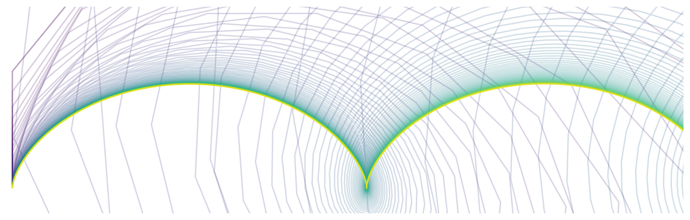

# PHY653: Computational Electromagnetics and Plasma Physics

- Semester: 2024/1
- Instructor: Pakorn Wongwaitayakornkul, PhD.
- Location: Computer Room LC4, Thammasat University, Rangsit Campus

## Course Description:
This course offers an exploration of computational methods used in studying electromagnetism and plasma physics, focusing on solving differential equations, simulating electromagnetic field interactions with charged particles, and investigating wave-particle interactions. Students will gain hands-on experience through computational labs using Jupyter Python notebooks to implement and solve problems related to the topics discussed in lectures. The course schedule is as follows:

## Course Materials:
| Chapter | Topics | Example Image |
| --- | ----------- | --- |
| 1 | [Python Basics and Particle Projectile Simulation](https://github.com/tpakorn/phy653/blob/main/code_lab/lab1/lecture1.ipynb) |  |
| 2 | [Time Integration Methods and Lorentz Motion](https://github.com/tpakorn/phy653/blob/main/code_lab/lab2/lecture2.ipynb) |  |
| 3 | [Motion of a Single Plasma Particle](https://github.com/tpakorn/phy653/blob/main/code_lab/lab3/lecture3.ipynb) |  |
| 4 | [Finite Difference Method for Electromagnetic Fields](https://github.com/tpakorn/phy653/blob/main/code_lab/lab4/lecture4.ipynb) |  |
| 5 | [Many Particles Systems](https://github.com/tpakorn/phy653/blob/main/code_lab/lab5/lecture5.ipynb) |  |